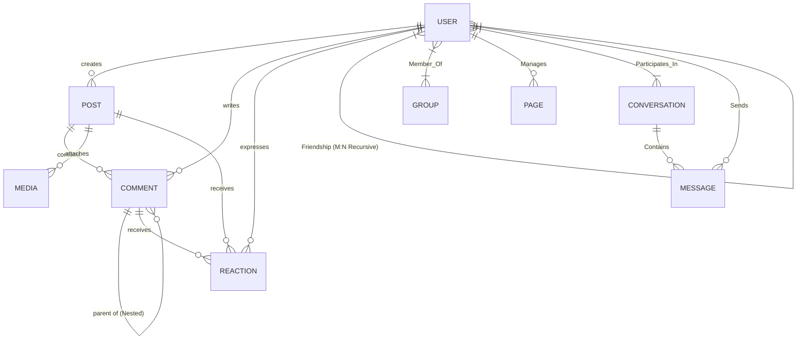

# Lecture 6: Case Study — Designing the ER Model of Facebook

---

## 1. System Requirements & Domain Scope

In top-tier system design and placement interviews, candidates are often asked to build a comprehensive ER diagram for a massive social network like Facebook. 

### Core Features in Scope:
1. **Users & Profiles**: Registration, credentials, privacy settings, biographical details.
2. **Friendship Graph**: Mutual friendships, follow requests, self-referencing relationship states (Pending, Accepted, Blocked).
3. **Posts & Media**: Text updates, photos, videos, privacy levels (Public, Friends-only, Custom).
4. **Interactions**: Comments (nested/threaded replies), Reactions (Polymorphic: Like, Love, Haha, Wow, Sad, Angry).
5. **Groups & Pages**: Admin ownership, memberships, posting on behalf of pages.
6. **Messaging System**: Direct 1-on-1 chats and group chat conversations with read receipts.

---

## 2. Complete Entity Set Breakdown

```
+-----------------------------------------------------------------------------------+
| ENTITY SET      | PRIMARY KEY       | ATTRIBUTES & SPECIFICATIONS                 |
+-----------------------------------------------------------------------------------+
| USER            | User_ID           | Email, Password_Hash, Full_Name, DOB, Reg_Date|
| POST            | Post_ID           | Content, Created_At, Privacy_Scope (Enum) |
| COMMENT         | Comment_ID        | Text_Content, Timestamp                       |
| REACTION        | Reaction_ID       | Reaction_Type (Like/Love/etc), Timestamp    |
| MEDIA           | Media_ID          | Media_URL, Media_Type (Image/Video), Size     |
| GROUP           | Group_ID          | Group_Name, Description, Privacy_Type         |
| PAGE            | Page_ID           | Page_Name, Category, Verified_Status          |
| CONVERSATION    | Conversation_ID   | Created_At, Is_Group_Chat (Boolean)           |
| MESSAGE         | Message_ID        | Body_Text, Sent_At, Media_Attachment_URL      |
+-----------------------------------------------------------------------------------+
```

---

## 3. Relationship Architecture & Cardinalities

```
                         [ USER ]
                         /  |   \
        (Self-Ref)      /   |    \
     < FRIENDSHIP >    /    |     \
      (Status, Date)  /     |      \
                     v      v       v
           [ POST ] <--- < CREATES > ---> [ GROUP ]
              |                             ^
              | 1                           | 1
          < HAS_MEDIA >                < OWNS_GROUP >
              | N                           | N
              v                             |
           [ MEDIA ]                 [ USER / ADMIN ]
```

### 3.1 Detailed Relationship Specs

#### 1. Self-Referencing Friendship Relationship (`FRIENDSHIP`)
* **Participating Entities**: `USER` (Role: `User_1`) and `USER` (Role: `User_2`).
* **Cardinality**: $M:N$ Recursive.
* **Attributes**: `Status` (`PENDING`, `ACCEPTED`, `BLOCKED`), `Action_User_ID`, `Created_At`.

#### 2. User Posts (`USER_POSTS`)
* `USER` 1 $\leftrightarrow$ $N$ `POST` (Total participation on Post side: every Post must have an author).

#### 3. Threaded Comments (`POST_COMMENTS` & `NESTED_REPLIES`)
* `POST` 1 $\leftrightarrow$ $N$ `COMMENT` (A post can have multiple top-level comments).
* Recursive Self-Relationship on `COMMENT`: `COMMENT` 1 $\leftrightarrow$ $N$ `COMMENT` (`Parent_Comment_ID` for nested comment threads).

#### 4. Polymorphic Reactions (`REACTION`)
* A user can react to a `POST` or a `COMMENT`.
* Formed via an Associative Aggregation Entity `REACTION(Reaction_ID, User_ID, Target_Type ['POST'|'COMMENT'], Target_ID, Reaction_Type)`.

#### 5. Groups & Pages Architecture
* `USER` $M \leftrightarrow N$ `GROUP` (`GROUP_MEMBERSHIP` with attributes: `Role` [`MEMBER`, `ADMIN`, `MODERATOR`], `Joined_At`).
* `USER` 1 $\leftrightarrow N$ `PAGE` (`PAGE_ADMIN` ownership).
* `PAGE` 1 $\leftrightarrow N$ `POST` (Pages creating wall posts).

#### 6. Direct Messaging System
* `USER` $M \leftrightarrow N$ `CONVERSATION` (`CONVERSATION_PARTICIPANT` with attribute `Last_Read_Message_ID`).
* `CONVERSATION` 1 $\leftrightarrow N$ `MESSAGE` (Total participation on Message side).
* `USER` 1 $\leftrightarrow N$ `MESSAGE` (`Sender_ID`).

---

## 4. Complete ER Diagram Structural Map (Mermaid Notation)



---

## 5. Conceptual Practice Exercises

1. How would you modify the `REACTION` entity set if Facebook introduces custom animated stickers alongside standard reaction types?
2. Design the relationship structure to record tagged users in a post image with explicit $(X, Y)$ coordinate bounding boxes.
3. Show how Privacy Settings (Public, Friends, Friends-of-Friends, Custom Blocklist) can be represented at the attribute vs entity relationship level.

---

## 6. Hard Placement & Interview Questions (FAANG Level)

### Q1: How do you handle Polymorphic Reactions (reacting to both Posts and Comments) in a strictly typed Relational Database schema without creating sparse tables full of NULL Foreign Keys?
**Answer:**
Three standard architectural patterns exist for Polymorphic Relations:

1. **Anti-Pattern (Sparse Foreign Keys)**:
   * `Reactions(Reaction_ID, User_ID, Post_ID [FK, NULL], Comment_ID [FK, NULL], Type)`.
   * *Drawback*: Requires `CHECK ((Post_ID IS NOT NULL AND Comment_ID IS NULL) OR ...)` constraint, creates high NULL fragmentation.

2. **Pattern A: Exclusive Arc / Multi-Table FKs (Recommended for SQL)**:
   * Create two separate concrete tables: `Post_Reactions(User_ID, Post_ID, Type)` and `Comment_Reactions(User_ID, Comment_ID, Type)`.
   * *Benefit*: Enforces strict foreign key integrity, zero NULLs, index-friendly.

3. **Pattern B: Superclass Target Entity (Base Interactive Object)**:
   * Create an abstract superclass entity `Interactable_Object(Object_ID, Object_Type ['POST', 'COMMENT'])`.
   * `POST` and `COMMENT` inherit/reference `Object_ID`.
   * `Reactions(User_ID, Object_ID [FK], Type)`.
   * *Benefit*: Clean uniform schema, facilitates global notification generation.

---

### Q2: How do you design the Friendship graph schema to ensure bidirectional lookup ($O(1)$ query to check if User A and User B are friends) while preventing duplicate inverse rows?
**Answer:**
* **Constraint Requirement**: If User 101 and User 202 are friends, we should avoid storing redundant duplicate rows `(101, 202)` and `(202, 101)` while ensuring efficient indexing.
* **Schema Design**:
  ```sql
  CREATE TABLE Friendships (
      User_ID_1 BIGINT NOT NULL,
      User_ID_2 BIGINT NOT NULL,
      Status VARCHAR(20) NOT NULL, -- 'PENDING', 'ACCEPTED'
      Action_User_ID BIGINT NOT NULL,
      Created_At TIMESTAMP DEFAULT CURRENT_TIMESTAMP,
      PRIMARY KEY (User_ID_1, User_ID_2),
      CHECK (User_ID_1 < User_ID_2), -- Force Canonical Ordering Rule
      FOREIGN KEY (User_ID_1) REFERENCES Users(User_ID),
      FOREIGN KEY (User_ID_2) REFERENCES Users(User_ID)
  );
  ```
* **Canonical Ordering Enforcement (`User_ID_1 < User_ID_2`)**:
  * Before inserting, application logic sorts IDs: `User_ID_1 = MIN(A, B)` and `User_ID_2 = MAX(A, B)`.
  * Guarantees exactly ONE row per friendship pair regardless of who initiated the request.
  * To check friendship: `SELECT Status FROM Friendships WHERE User_ID_1 = LEAST(A, B) AND User_ID_2 = GREATEST(A, B);`

---

### Q3: How would you model Nested/Threaded Comments (like Reddit or Facebook comment threads) in an ER model and relational schema? Compare Adjacency List vs. Path Enumeration vs. Closure Table models.

**Answer:**

1. **Adjacency List (`Parent_Comment_ID`)**:
   * Each comment stores a foreign key `Parent_Comment_ID` referencing `Comment_ID`.
   * *Pros*: Simple inserts ($O(1)$).
   * *Cons*: Fetching an entire deep comment tree requires expensive recursive CTEs (`WITH RECURSIVE`).

2. **Path Enumeration (`Materialized Path`)**:
   * Each comment stores a string path representing its full lineage: `Path = "1/4/12/45"`.
   * *Pros*: Fetching all sub-tree replies uses a fast `LIKE '1/4/%'` prefix scan.
   * *Cons*: Updating paths during tree node re-parenting requires updating all descendant rows.

3. **Closure Table (`Comment_Ancestry`)**:
   * Maintain a separate lookup table `Comment_Tree(Ancestor_ID, Descendant_ID, Depth)`.
   * *Pros*: Fastest subtree lookups, excellent query isolation, handles infinite depth cleanly.
   * *Cons*: Requires additional storage overhead and multi-row writes per comment insertion.
