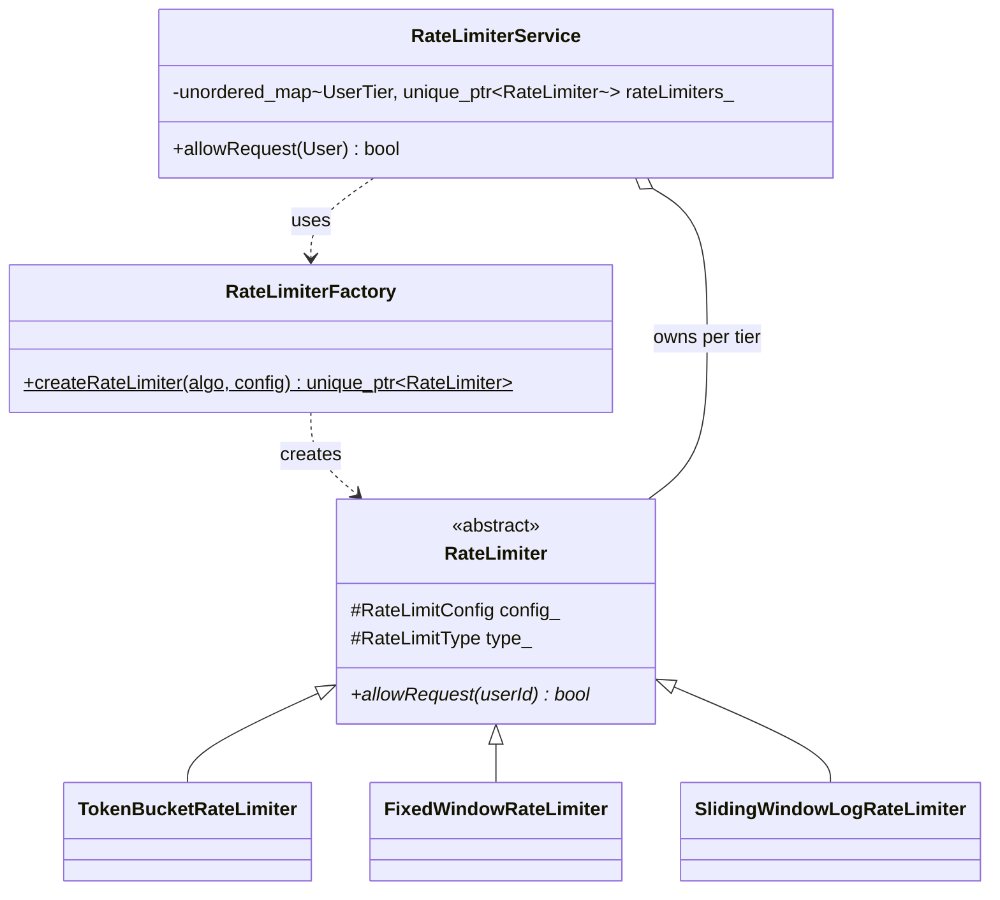

## Rate Limiter (C++ port)

C++ translation of [shubhkpatel/Low-Level-Design — `rate_limiter`](https://github.com/shubhkpatel/Low-Level-Design/tree/main/src/main/java/org/nailyourinterview/lld/rate_limiter).

The original is Java: an abstract `RateLimiter` strategy, three concrete algorithms (`TokenBucket`, `FixedWindow`, `SlidingWindowLog`), a `RateLimiterFactory` to instantiate them, and a `RateLimiterService` that maps `UserTier -> RateLimiter`. This note keeps that exact shape and explains every place the C++ version had to make a real decision instead of just transliterating syntax.

---

### Architecture



Two patterns, same as the Java source:

- **Strategy** — `RateLimiter` is the algorithm interface; each subclass is an interchangeable rate-limiting policy.
- **Factory** — `RateLimiterFactory` centralizes the mapping from `RateLimitType` to a concrete class, so `RateLimiterService` never names a concrete limiter type directly.

**Java → C++ mapping, at a glance**

| Java                                                   | C++                                                      | Why                                                                                                                               |
| ------------------------------------------------------ | -------------------------------------------------------- | --------------------------------------------------------------------------------------------------------------------------------- |
| `enum`                                                 | `enum class`                                             | scoped, no implicit int conversion — a `UserTier` can't silently compare equal to a `RateLimitType`                               |
| GC-owned object returned from factory                  | `std::unique_ptr<RateLimiter>`                           | C++ has no GC; the factory must hand off clear, single ownership                                                                  |
| `ConcurrentHashMap.compute(id, ...)`                   | `std::mutex` + `std::unordered_map`                      | the STL has no lock-free/striped concurrent map; a mutex around the map is the direct equivalent                                  |
| Lombok `@Getter`/`@AllArgsConstructor`                 | hand-written constructor + getters                       | C++ has no annotation processor; ~4 lines of boilerplate replace what Lombok generates                                            |
| `System.currentTimeMillis()`                           | `steady_clock` (2 limiters) / `system_clock` (1 limiter) | see [Clock choice](#clock-choice) below — this is a deliberate improvement, not a 1:1 copy                                        |
| `CyclicBarrier` + `CountDownLatch` + `ExecutorService` | `std::barrier` + `std::thread` + `join()`                | `join()` already blocks until completion, so no separate latch is needed — see [Main / concurrency demo](#main--concurrency-demo) |

---

### `enums/RateLimitType.h`

```cpp
#pragma once

enum class RateLimitType {
    TokenBucket,
    LeakyBucket,
    FixedWindow,
    SlidingWindowLog,
    SlidingWindowCounter
};
```

### `enums/UserTier.h`

```cpp
#pragma once

enum class UserTier {
    Free,
    Premium
};
```

**Design decision — `enum class` over `enum`.** The Java source uses plain `enum`, which is already type-safe in Java (Java enums are real classes). Plain C `enum` in C++ is *not* type-safe — its values leak into the surrounding scope and implicitly convert to `int`. `enum class` is the C++ feature that actually matches Java's guarantee: `RateLimitType::FixedWindow` cannot be compared to a raw `int` or to a `UserTier` value by accident.

---

### `model/RateLimitConfig.h`

```cpp
#pragma once

struct RateLimitConfig {
    const int maxRequests;
    const int windowInSeconds;
};
```

### `model/User.h`

```cpp
#pragma once

#include <string>
#include "../enums/UserTier.h"

class User {
public:
    User(std::string userId, UserTier tier)
        : userId_(std::move(userId)), tier_(tier) {}

    const std::string& getUserId() const { return userId_; }
    UserTier getTier() const { return tier_; }

private:
    const std::string userId_;
    const UserTier tier_;
};
```

**Design decision — `struct` for `RateLimitConfig`, `class` with getters for `User`.** Both are plain data carriers in Java (`@Getter @AllArgsConstructor`). `RateLimitConfig` is only ever read as a pair of fields, so a `struct` with `const` members is the direct, boilerplate-free equivalent of "immutable value object." `User` keeps explicit `getUserId()`/`getTier()` methods instead of public fields purely so call sites (`user.getUserId()`) read identically to the Java original — idiomatic C++ would often just expose `const` public members here, but matching the reference implementation's call shape made the port easier to verify line-by-line.

---

### `limiter/RateLimiter.h`

```cpp
#pragma once

#include <string>
#include "../enums/RateLimitType.h"
#include "../model/RateLimitConfig.h"

class RateLimiter {
public:
    RateLimiter(RateLimitConfig config, RateLimitType type)
        : config_(config), type_(type) {}

    virtual ~RateLimiter() = default;

    virtual bool allowRequest(const std::string& userId) = 0;

protected:
    const RateLimitConfig config_;
    const RateLimitType type_;
};
```

**Design decision — abstract base class, virtual destructor, no copy/move.** Java's `abstract class` with one abstract method is exactly a C++ abstract base class with one pure virtual function (`= 0`). The `virtual ~RateLimiter() = default;` is *not* in the Java source because Java never needs it — the GC handles cleanup regardless of static type. In C++, deleting a derived object through a `RateLimiter*` (which is exactly what `unique_ptr<RateLimiter>` does) is undefined behavior without a virtual destructor, so it's mandatory here, not optional.

None of the subclasses declare copy or move operations. That's deliberate rather than an omission: each subclass holds a `std::mutex` member, and `std::mutex` is non-copyable and non-movable, so the compiler already deletes copy/move for us. This is a good thing — these objects represent live, stateful counters; copying one would silently duplicate (and desynchronize) its internal state. Java has no equivalent failure mode because objects are always reference types there.

---

### `limiter/FixedWindowRateLimiter.h` / `.cpp`

```cpp
// FixedWindowRateLimiter.h
#pragma once

#include <chrono>
#include <mutex>
#include <string>
#include <unordered_map>
#include "RateLimiter.h"

class FixedWindowRateLimiter : public RateLimiter {
public:
    explicit FixedWindowRateLimiter(RateLimitConfig config);

    bool allowRequest(const std::string& userId) override;

private:
    struct WindowState {
        long long windowIndex;
        int count;
    };

    std::mutex mutex_;
    std::unordered_map<std::string, WindowState> state_;
};
```

```cpp
// FixedWindowRateLimiter.cpp
#include "FixedWindowRateLimiter.h"

FixedWindowRateLimiter::FixedWindowRateLimiter(RateLimitConfig config)
    : RateLimiter(config, RateLimitType::FixedWindow) {}

bool FixedWindowRateLimiter::allowRequest(const std::string& userId) {
    using namespace std::chrono;

    long long nowSeconds =
        duration_cast<seconds>(system_clock::now().time_since_epoch()).count();
    long long currentWindow = nowSeconds / config_.windowInSeconds;

    std::lock_guard<std::mutex> lock(mutex_);

    auto it = state_.find(userId);
    if (it == state_.end() || it->second.windowIndex != currentWindow) {
        // new window (or first request ever) -> reset counter
        state_[userId] = WindowState{currentWindow, 1};
        return true;
    }

    if (it->second.count < config_.maxRequests) {
        ++it->second.count;
        return true;
    }

    return false;
}
```

**Design decision — one mutex, one map, one entry per user.** This is the one place the C++ port actually *fixes a bug* rather than translating faithfully. The Java version keeps two separate maps:

```java
private final Map<String, Integer> requestCount = new ConcurrentHashMap<>();
private final Map<String, Long> windowStart = new HashMap<>();   // <-- plain HashMap!
```

`requestCount` is thread-safe on its own, but `windowStart` is a plain `HashMap` mutated from multiple threads with no synchronization — a genuine data race under concurrent load (the exact scenario `Main.checkConcurrency` stress-tests). The C++ version merges both fields into one `WindowState{windowIndex, count}` struct behind a single `std::mutex`, so the window index and the counter are always read/written together, atomically, as one unit. There is no equivalent of "compute one map atomically while another map next to it is unprotected."

The tradeoff being made explicit: this mutex is *coarser* than Java's `ConcurrentHashMap`, which stripes its locks internally so unrelated keys (different users) rarely contend. Here, every user's request briefly locks the same mutex. For an interview-scale or single-service rate limiter this is a non-issue (the critical section is a handful of integer/branch ops). If this needed to scale to many distinct users under heavy contention, the fix is the same idea `ConcurrentHashMap` uses internally: shard the map into N buckets, each with its own mutex, and hash `userId` to pick a bucket.

---

### `limiter/SlidingWindowLogRateLimiter.h` / `.cpp`

```cpp
// SlidingWindowLogRateLimiter.h
#pragma once

#include <chrono>
#include <deque>
#include <mutex>
#include <string>
#include <unordered_map>
#include "RateLimiter.h"

class SlidingWindowLogRateLimiter : public RateLimiter {
public:
    explicit SlidingWindowLogRateLimiter(RateLimitConfig config);

    bool allowRequest(const std::string& userId) override;

private:
    std::mutex mutex_;
    std::unordered_map<std::string, std::deque<std::chrono::steady_clock::time_point>> requestLog_;
};
```

```cpp
// SlidingWindowLogRateLimiter.cpp
#include "SlidingWindowLogRateLimiter.h"

SlidingWindowLogRateLimiter::SlidingWindowLogRateLimiter(RateLimitConfig config)
    : RateLimiter(config, RateLimitType::SlidingWindowLog) {}

bool SlidingWindowLogRateLimiter::allowRequest(const std::string& userId) {
    using namespace std::chrono;

    auto now = steady_clock::now();
    auto window = seconds(config_.windowInSeconds);

    std::lock_guard<std::mutex> lock(mutex_);
    auto& log = requestLog_[userId];

    while (!log.empty() && (now - log.front()) >= window) {
        log.pop_front();
    }

    if (static_cast<int>(log.size()) < config_.maxRequests) {
        log.push_back(now);
        return true;
    }

    return false;
}
```

**Design decision — `std::deque`, not `std::queue<...ArrayDeque...>`.** Java's `ArrayDeque` is a growable ring buffer used purely as a FIFO (`peek`/`poll`/`add`). `std::deque` gives the same O(1) push-back / pop-front behavior and is the STL's direct analogue — `std::queue` is only an adapter and would just wrap a `deque` anyway, so using `deque` directly avoids an unnecessary layer.

**Design decision — timestamps as `steady_clock::time_point`, not epoch seconds.** The Java code stores raw `long` seconds since epoch in the log. Storing `time_point` objects instead of converting to integers keeps the comparison (`now - log.front() >= window`) expressed in `std::chrono` durations, which the type system checks at compile time (you cannot accidentally compare seconds to milliseconds — it won't compile). See the [Clock choice](#clock-choice) note below for why `steady_clock` specifically.

---

### `limiter/TokenBucketRateLimiter.h` / `.cpp`

```cpp
// TokenBucketRateLimiter.h
#pragma once

#include <chrono>
#include <mutex>
#include <string>
#include <unordered_map>
#include "RateLimiter.h"

class TokenBucketRateLimiter : public RateLimiter {
public:
    explicit TokenBucketRateLimiter(RateLimitConfig config);

    bool allowRequest(const std::string& userId) override;

private:
    struct BucketState {
        int tokens;
        std::chrono::steady_clock::time_point lastRefill;
    };

    int refillTokens(BucketState& state, std::chrono::steady_clock::time_point now) const;

    std::mutex mutex_;
    std::unordered_map<std::string, BucketState> buckets_;
};
```

```cpp
// TokenBucketRateLimiter.cpp
#include "TokenBucketRateLimiter.h"

TokenBucketRateLimiter::TokenBucketRateLimiter(RateLimitConfig config)
    : RateLimiter(config, RateLimitType::TokenBucket) {}

int TokenBucketRateLimiter::refillTokens(BucketState& state,
                                          std::chrono::steady_clock::time_point now) const {
    using namespace std::chrono;

    double refillRateSeconds =
        static_cast<double>(config_.windowInSeconds) / config_.maxRequests;

    double elapsedSeconds = duration<double>(now - state.lastRefill).count();
    int refillCount = static_cast<int>(elapsedSeconds / refillRateSeconds);

    state.tokens = std::min(config_.maxRequests, state.tokens + refillCount);
    if (refillCount > 0) {
        state.lastRefill = now;
    }
    return state.tokens;
}

bool TokenBucketRateLimiter::allowRequest(const std::string& userId) {
    auto now = std::chrono::steady_clock::now();

    std::lock_guard<std::mutex> lock(mutex_);

    auto [it, inserted] = buckets_.try_emplace(userId, BucketState{config_.maxRequests, now});
    BucketState& state = it->second;

    int currentTokens = refillTokens(state, now);
    if (currentTokens > 0) {
        state.tokens = currentTokens - 1;
        return true;
    }
    return false;
}
```

**Design decision — bucket starts full, seeded with `now`.** `try_emplace(userId, BucketState{maxRequests, now})` matches the Java behavior exactly: `tokens.getOrDefault(userId, config.getMaxRequests())` means an unseen user's bucket is treated as full on their first request, and `lastRefillTime.putIfAbsent(userId, now)` seeds the refill clock at first contact rather than at limiter-construction time. `try_emplace` is the one STL call that does both "insert if absent, otherwise get the existing entry" in a single lookup — the C++ equivalent of chaining `getOrDefault` + `putIfAbsent` without hitting the map twice.

**Carried-over limitation, not fixed.** Both the Java and C++ versions only advance `lastRefill`/`lastRefillTime` when at least one whole token was refilled (`if (refillCount > 0)`). Any leftover fractional time within a partial token period is discarded rather than carried forward, so a bucket can drift and refill very slightly slower than the configured rate over many small requests. This is a pre-existing property of the reference implementation, kept as-is for fidelity — flagged here rather than silently fixed, unlike the `FixedWindowRateLimiter` race above, since it changes observable behavior rather than just fixing a thread-safety hole.

---

### Clock choice

The Java source uses `System.currentTimeMillis()` everywhere. The C++ port intentionally uses two different clocks for two different reasons:

- **`FixedWindowRateLimiter` uses `system_clock`** (wall-clock, epoch-based) because its algorithm needs windows aligned to actual calendar time (e.g. "the 60-second window starting at `:00`"). That only means something relative to a shared epoch, exactly like Java's `currentTimeMillis() / 1000 / windowInSeconds`.
- **`SlidingWindowLogRateLimiter` and `TokenBucketRateLimiter` use `steady_clock`** because both only ever compute *elapsed time* (`now - lastEvent`), never an absolute wall-clock window. `steady_clock` is monotonic — guaranteed never to jump backward — whereas `system_clock` (and Java's `currentTimeMillis()`) can jump if the OS clock is adjusted by NTP or a manual change. A backward jump in a wall clock would let `elapsedSeconds` go negative, under-refilling a token bucket or corrupting the sliding-window eviction check. This is a genuine improvement over the reference implementation, not just a syntax swap — worth calling out since "translate the code" could otherwise mean reproducing this latent bug too.

---

### `factory/RateLimiterFactory.h` / `.cpp`

```cpp
// RateLimiterFactory.h
#pragma once

#include <memory>
#include "../enums/RateLimitType.h"
#include "../limiter/RateLimiter.h"
#include "../model/RateLimitConfig.h"

class RateLimiterFactory {
public:
    static std::unique_ptr<RateLimiter> createRateLimiter(RateLimitType algo, RateLimitConfig config);
};
```

```cpp
// RateLimiterFactory.cpp
#include "RateLimiterFactory.h"
#include <stdexcept>
#include "../limiter/FixedWindowRateLimiter.h"
#include "../limiter/SlidingWindowLogRateLimiter.h"
#include "../limiter/TokenBucketRateLimiter.h"

std::unique_ptr<RateLimiter> RateLimiterFactory::createRateLimiter(RateLimitType algo,
                                                                     RateLimitConfig config) {
    switch (algo) {
        case RateLimitType::TokenBucket:
            return std::make_unique<TokenBucketRateLimiter>(config);
        case RateLimitType::FixedWindow:
            return std::make_unique<FixedWindowRateLimiter>(config);
        case RateLimitType::SlidingWindowLog:
            return std::make_unique<SlidingWindowLogRateLimiter>(config);
        default:
            throw std::invalid_argument("Unknown or unimplemented algorithm");
    }
}
```

**Design decision — `unique_ptr<RateLimiter>` return type, `make_unique` construction.** This is the load-bearing change for memory safety in the whole port. Java's `new TokenBucketRateLimiter(config)` returns a GC-managed reference with implicit shared ownership semantics; nothing in the language forces anyone to think about who's responsible for freeing it. C++ has no GC, so the factory must be explicit: it returns `unique_ptr`, which states in the type signature "the caller now owns this object outright, and it will be destroyed automatically when they're done with it." `make_unique` (over bare `new` + wrapping) also guarantees no leak is possible if construction throws mid-expression. `switch` over `enum class` still requires the `default:` case — C++ doesn't do Java's exhaustiveness-adjacent pattern-match warnings for `switch`/`enum class` the way its `switch` expression does, so the `throw` is what makes an unhandled `LeakyBucket`/`SlidingWindowCounter` fail loudly instead of silently returning null.

---

### `service/RateLimiterService.h` / `.cpp`

```cpp
// RateLimiterService.h
#pragma once

#include <memory>
#include <unordered_map>
#include "../enums/UserTier.h"
#include "../limiter/RateLimiter.h"
#include "../model/User.h"

class RateLimiterService {
public:
    RateLimiterService();

    bool allowRequest(const User& user);

private:
    std::unordered_map<UserTier, std::unique_ptr<RateLimiter>> rateLimiters_;
};
```

```cpp
// RateLimiterService.cpp
#include "RateLimiterService.h"
#include <stdexcept>
#include "../enums/RateLimitType.h"
#include "../factory/RateLimiterFactory.h"

RateLimiterService::RateLimiterService() {
    // Configure per-tier limits + algorithms
    rateLimiters_.emplace(
        UserTier::Free,
        RateLimiterFactory::createRateLimiter(RateLimitType::TokenBucket, RateLimitConfig{10, 60}) // 10 req/min
    );

    rateLimiters_.emplace(
        UserTier::Premium,
        RateLimiterFactory::createRateLimiter(RateLimitType::FixedWindow, RateLimitConfig{100, 60}) // 100 req/min
    );
}

bool RateLimiterService::allowRequest(const User& user) {
    auto it = rateLimiters_.find(user.getTier());
    if (it == rateLimiters_.end()) {
        throw std::invalid_argument("No limiter configured for this tier");
    }
    return it->second->allowRequest(user.getUserId());
}
```

**Design decision — `unordered_map<UserTier, unique_ptr<RateLimiter>>` needs no custom hash.** `std::hash` has had a defined specialization for all scoped enum (`enum class`) types since C++14, so `UserTier` works as an `unordered_map` key with zero extra code — the same convenience Java gets for free from every enum's `hashCode()`.

**Design decision — the service owns the limiters outright.** `rateLimiters_.emplace(tier, factory::createRateLimiter(...))` moves the `unique_ptr` straight from the factory into the map — ownership transfers once, with no copy, no raw pointer ever exposed. When a `RateLimiterService` is destroyed, its map destructor runs, which destroys each `unique_ptr`, which destroys each limiter — no manual cleanup code anywhere, mirroring how little the Java version has to think about lifetime, just achieved through RAII instead of GC.

---

### `main.cpp` / concurrency demo

```cpp
#include <barrier>
#include <iostream>
#include <sstream>
#include <thread>
#include <vector>

#include "enums/UserTier.h"
#include "model/User.h"
#include "service/RateLimiterService.h"

// call allowRequest 20 times simultaneously against the same user
void checkConcurrency(RateLimiterService& rateLimiterService) {
    User freeUser1("user1", UserTier::Free);

    constexpr int threads = 20; // simulate 20 concurrent requests
    std::barrier syncPoint(threads);
    std::vector<std::thread> pool;
    pool.reserve(threads);

    for (int i = 1; i <= threads; ++i) {
        pool.emplace_back([&rateLimiterService, &freeUser1, &syncPoint, i]() {
            syncPoint.arrive_and_wait(); // all threads wait here until the barrier is full

            bool allowed = rateLimiterService.allowRequest(freeUser1);

            std::ostringstream tid;
            tid << std::this_thread::get_id();
            std::cout << "Thread " << tid.str()
                      << " | Request " << i << " for FreeUser1: "
                      << (allowed ? "ALLOWED" : "BLOCKED") << "\n";
        });
    }

    for (auto& t : pool) t.join(); // wait for all threads to finish
}

int main() {
    RateLimiterService rateLimiterService;

    User freeUser("user1", UserTier::Free);       // 10 req in 60 sec
    User premiumUser("user2", UserTier::Premium); // 100 req in 60 sec

    // === Free User Requests ===
    // for (int i = 1; i <= 15; ++i) {
    //     bool allowed = rateLimiterService.allowRequest(freeUser);
    //     std::cout << "Request " << i << " for Free User: " << (allowed ? "ALLOWED" : "BLOCKED") << "\n";
    //     std::this_thread::sleep_for(std::chrono::milliseconds(100));
    // }
    //
    // === Premium User Requests ===
    // for (int i = 1; i <= 120; ++i) {
    //     bool allowed = rateLimiterService.allowRequest(premiumUser);
    //     std::cout << "Request " << i << " for Premium User: " << (allowed ? "ALLOWED" : "BLOCKED") << "\n";
    //     std::this_thread::sleep_for(std::chrono::milliseconds(100));
    // }

    checkConcurrency(rateLimiterService);
    return 0;
}
```

**Design decision — `std::barrier`, but no `std::latch`.** Java's demo needs two separate primitives: a `CyclicBarrier` to release all 20 threads at once (maximizing actual contention on the rate limiter), and a `CountDownLatch` purely so `main` knows when every task has finished before calling `executor.shutdown()`. `std::barrier` (C++20) is the direct match for the first job. The second job doesn't need a separate primitive in C++: `std::thread::join()` already blocks the calling thread until that specific thread finishes, so looping `for (auto& t : pool) t.join();` gives exactly the "wait for all 20 to complete" guarantee a `CountDownLatch` was providing — one fewer moving part, not a missing feature.

---

### Build

```cmake
# CMakeLists.txt
cmake_minimum_required(VERSION 3.16)
project(rate_limiter)

set(CMAKE_CXX_STANDARD 20)
set(CMAKE_CXX_STANDARD_REQUIRED ON)

find_package(Threads REQUIRED)

add_executable(rate_limiter
    main.cpp
    limiter/FixedWindowRateLimiter.cpp
    limiter/SlidingWindowLogRateLimiter.cpp
    limiter/TokenBucketRateLimiter.cpp
    factory/RateLimiterFactory.cpp
    service/RateLimiterService.cpp
)

target_link_libraries(rate_limiter PRIVATE Threads::Threads)
```

C++20 is required for `std::barrier`; everything else here only needs C++17. Single-command alternative:

```bash
g++ -std=c++20 -O2 -pthread \
    main.cpp \
    limiter/FixedWindowRateLimiter.cpp \
    limiter/SlidingWindowLogRateLimiter.cpp \
    limiter/TokenBucketRateLimiter.cpp \
    factory/RateLimiterFactory.cpp \
    service/RateLimiterService.cpp \
    -o rate_limiter
```

`-pthread` (or `Threads::Threads` in CMake) is required — unlike Java, where `java.util.concurrent` is always available, C++ threading support must be explicitly linked.

---

### Summary of every deliberate deviation from the Java source

1. `FixedWindowRateLimiter`: merged two maps (one thread-safe, one not — a real data race in the original) into one map guarded by one mutex.
2. `SlidingWindowLogRateLimiter` / `TokenBucketRateLimiter`: switched from wall-clock (`currentTimeMillis`) to `steady_clock`, immune to backward clock jumps.
3. `FixedWindowRateLimiter` kept `system_clock` deliberately, since its algorithm needs epoch-aligned windows.
4. `TokenBucketRateLimiter`'s fractional-refill-time drift was *kept*, not fixed — flagged as a known, inherited limitation rather than silently changed.
5. Ownership made explicit everywhere via `unique_ptr` — the factory, and the service's map, both state in their types who owns what, replacing what GC did implicitly.
6. `CountDownLatch` dropped from the concurrency demo — `std::thread::join()` already provides that guarantee.
